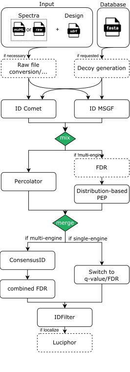

# nf-core/quantms: Output

## Introduction

This document describes the output produced by the pipeline. Most of the plots are taken from the MultiQC report, which summarises results at the end of the pipeline.

The directories listed below will be created in the results directory after the pipeline has finished. All paths are relative to the top-level results directory.

## Pipeline overview

The pipeline is built using [Nextflow](https://www.nextflow.io/) and processes data using the following steps for DDA-LFQ and DDA-ISO data:

1. (optional) Conversion of spectra data to indexedMzML: Using ThermoRawFileParser if Thermo Raw or using OpenMS' FileConverter if just an index is missing
2. (optional) Decoy database generation for the provided DB (fasta) with OpenMS
3. Database search with either MSGF+ and/or Comet through OpenMS adapters
4. Re-mapping potentially identified peptides to the input database for consistency and error-checking (using OpenMS' PeptideIndexer)
5. PSM rescoring using PSMFeatureExtractor and Percolator or a PeptideProphet-like distribution fitting approach in OpenMS
6. If multiple search engines were chosen, the results are combined with OpenMS' ConsensusID
7. If multiple search engines were chosen, a combined FDR is calculated
8. Single run PSM/Peptide-level FDR filtering
9. If localization of modifications was requested, Luciphor2 is applied via the OpenMS adapter
10. (**DDA-LFQ**) Protein inference and labelfree quantification based on spectral counting or MS1 feature detection, alignment and integration with OpenMS' ProteomicsLFQ. Performs an additional experiment-wide FDR filter on protein (and if requested peptide/PSM-level).
11. (**DDA-ISO**) Extracts and normalizes isobaric labeling
12. (**DDA-ISO**) Protein inference using the OpenMS ProteinInference tool. In addition, protein FDR filterting is performed in this step for Isobaric datasets (TMT, iTRAQ).
13. (**DDA-ISO**) Protein Quantification
14. Generation of QC reports using pMultiQC a library for QC proteomics data analysis.

For DIA-LFQ experiments, the workflows is different:

1. RAW data is converted to mzML using the ThermoRawFileParser
2. DIA-NN is used to for identification, quantification of the peptides and proteins
3. Generation of output files
4. Generation of QC reports using pMultiQC a library for QC proteomics data analysis.

As an example, a rough visualization of the DDA identification subworkflow can be seen here:

## Output structure

Output is by default written to the $NXF_WORKSPACE/results folder. Each step of the workflow export different files and reports with the specific data, peptide identifications, protein quantifications, etc. Most of the pipeline outputs are [HUPO-PSI](https://www.psidev.info/) standard file formats:

- [mzML](https://www.psidev.info/mzML): The mzML format is an open, XML-based format for mass spectrometer output files, developed with the full participation of vendors and researchers in order to create a single open format that would be supported by all software.
- [mzTab](https://www.psidev.info/mztab>): mzTab is intended as a lightweight supplement to the existing standard mzML to store and represent peptide and protein and identifications together with experimental metadata and basic quantitative information.

The output consists of the following folders (follow the links for a more detailed description):

results

- spectra data:
    - [thermorawfileparser/*.mzML](#spectra)
- identification results:
    - [searchenginecomet/*.idXML](#identifications)
    - [searchenginemsgf/*.idXML](#identifications)
- consensusID identifications:
    - [consensusid/*.idXML](#identifications)
- pipeline information:
    - [pipeline_info/...](#nextflow-pipeline-info)
- DDA-LFQ quantification results:
    - [proteomicslfq/out.consensusXML](#consenusxml)
    - [proteomicslfq/out_msstats.csv](#msstats-ready-quantity-table)
    - [proteomicslfq/out_triqler.tsv](#triqler)
    - [proteomicslfq/out.mzTab](#mztab)
- DDA-ISO quantification results:
    - [proteinquantifier/out.mzTab](#mztab)
    - [proteinquantifier/peptide_out.csv](#openms-formats)
    - [proteinquantifier/protein_out.csv](#openms-formats)
    - [msstatsconverter/out_msstats.csv](#msstats-ready-quantity-table)
- DIA-LFQ quantification results:
    - [convert2msstats/out_msstats.csv](#msstats-ready-quantity-table)

## Output description

### Nextflow pipeline info

[Nextflow](https://www.nextflow.io/docs/latest/tracing.html) provides excellent functionality for generating various reports relevant to the running and execution of the pipeline. This will allow you to troubleshoot errors with the running of the pipeline, and also provide you with other information such as launch commands, run times and resource usage.

Output files

* `pipeline_info/`
    * Reports generated by Nextflow: `execution_report.html`, `execution_timeline.html`, `execution_trace.txt` and `pipeline_dag.dot`/`pipeline_dag.svg`.
    * Reports generated by the pipeline: `pipeline_report.html`, `pipeline_report.txt` and `software_versions.yml`. The `pipeline_report*` files will only be present if the `--email` / `--email_on_fail` parameter's are used when running the pipeline.
    * Reformatted samplesheet files used as input to the pipeline: `samplesheet.valid.csv`.

### Identifications

Intermediate output for the PSM/peptide-level filtered identifications per raw/mzML file in OpenMS'
internal [idXML](https://github.com/OpenMS/OpenMS/blob/develop/share/OpenMS/SCHEMAS/IdXML_1_5.xsd) format.

### ProteomicsLFQ main output

The `proteomics_lfq` folder contains the output of the pipeline without any statistical postprocessing.
It is available in three different formats:

#### ConsensusXML

A [consensusXML](https://github.com/OpenMS/OpenMS/blob/develop/share/OpenMS/SCHEMAS/ConsensusXML_1_7.xsd) file as the closest representation of the internal data
structures generated by OpenMS. Helpful for debugging and downstream processing with OpenMS tools.

#### MSstats-ready quantity table

A simple tsv file ready to be read by the OpenMStoMSstats function of the MSstats R package. It should hold
the same quantities as the consensusXML but rearranged in a "long" table format with additional information
about the experimental design used by MSstats.

#### OpenMS formats

In addition to the consensusXML and idXML formats, OpenMS generates other formats that can help the downstream analysis of the quantms results.

- peptide_out.tsv: The peptide output (peptide_out.tsv) from [ProteinQuantifier](https://abibuilder.informatik.uni-tuebingen.de/archive/openms/Documentation/nightly/html/TOPP_ProteinQuantifier.html) contains a peptide table with the corresponding quantification data.
- protein_out.tsv: The protein output (protein_out.tsv) from [ProteinQuantifier](https://abibuilder.informatik.uni-tuebingen.de/archive/openms/Documentation/nightly/html/TOPP_ProteinQuantifier.html) contains the protein information including quantification values.

#### mzTab

A complete [mzTab](https://github.com/HUPO-PSI/mzTab) file ready for submission to [PRIDE](https://www.ebi.ac.uk/pride/).

### MSstats output

The `msstats` folder contains [MSstats](https://github.com/MeenaChoi/MSstats)' post-processed (e.g. imputation, outlier removal) quantities and statistical
measures of significance for different tested contrasts of the given experimental design. It also includes basic plots of these results.
The results will only be available if there was more than one condition.

#### MSstats mzTab

The [mzTab](https://github.com/HUPO-PSI/mzTab) from the proteomics_lfq folder with replaced normalized and imputed quantities from MSstats. This might contain less quantities since MSstats filters proteins with too many missing values.

#### MSstats table

See [MSstats vignette](https://www.bioconductor.org/packages/release/bioc/vignettes/MSstats/inst/doc/MSstats.html).
